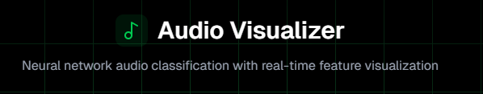
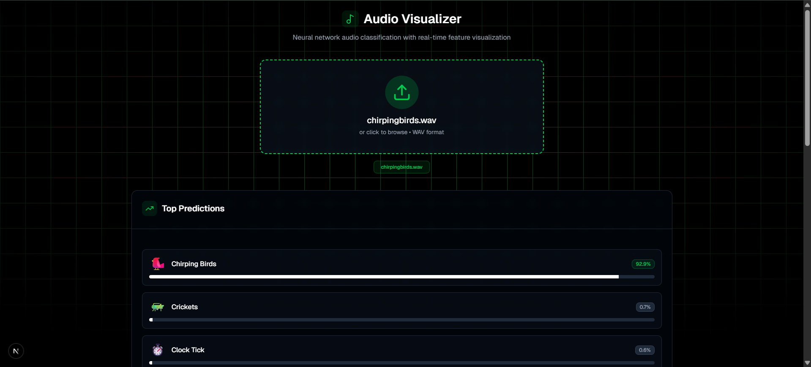
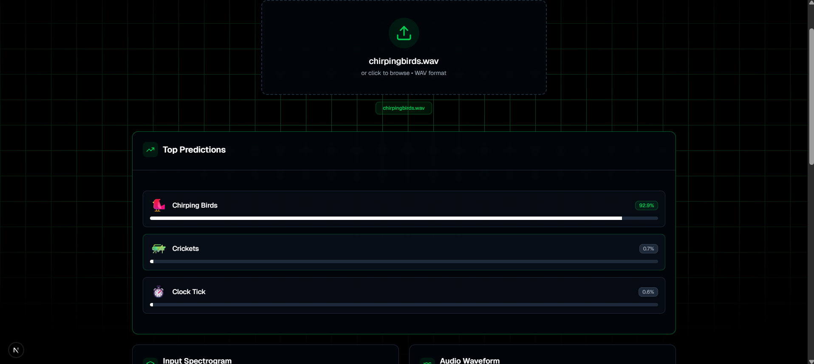
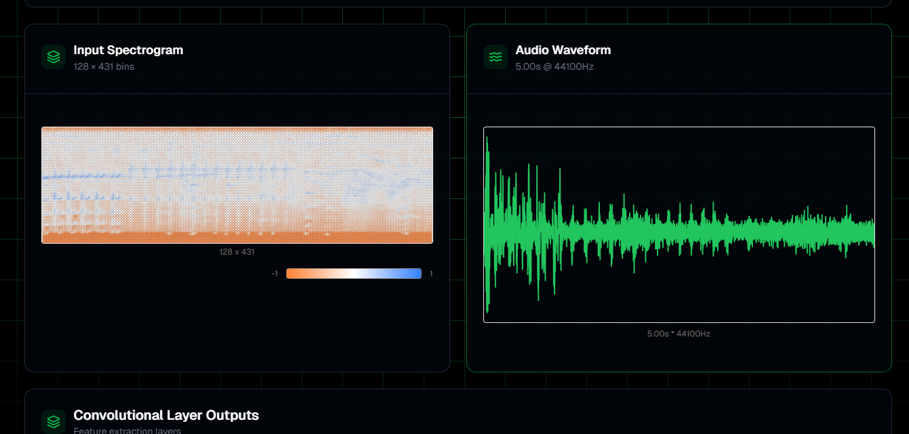
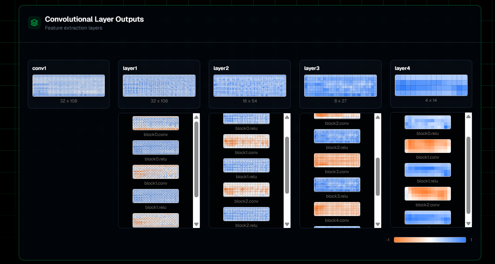

# CNN Audio Classification & Visualization

A sophisticated audio classification system using Convolutional Neural Networks (CNN) with an interactive web interface for real-time visualization of model predictions and feature maps.



## Overview

This project combines deep learning with modern web technologies to create an end-to-end audio classification system. The CNN model is trained on the ESC-50 dataset to classify environmental sounds, while the Next.js frontend provides beautiful visualizations of the model's internal workings.

## Features

- **Real-time Audio Classification**: Upload audio files and get instant predictions
- **Interactive Visualizations**: View CNN feature maps, spectrograms, and waveforms
- **Modern Web Interface**: Built with Next.js, React, and Tailwind CSS
- **GPU-Powered Backend**: Deployed on Modal with A10G GPU acceleration
- **ResNet Architecture**: Deep residual network for improved accuracy
- **50 Audio Classes**: Classifies environmental sounds from the ESC-50 dataset

## Architecture

### System Overview

The system consists of three main components:

1. **CNN Model** (PyTorch) - Residual network for audio classification
2. **Backend API** (Modal + FastAPI) - GPU-accelerated inference service
3. **Frontend Interface** (Next.js) - Interactive visualization dashboard

### Tech Stack

#### Backend
- **PyTorch** - Deep learning framework
- **Modal** - Serverless GPU deployment platform
- **FastAPI** - Modern API framework
- **Librosa** - Audio processing library
- **ESC-50 Dataset** - Environmental sound classification

#### Frontend
- **Next.js 15** - React framework with App Router
- **TypeScript** - Type-safe JavaScript
- **Tailwind CSS** - Utility-first CSS framework
- **Framer Motion** - Smooth animations
- **Lucide React** - Beautiful icons

## Quick Start

### Prerequisites

- Python 3.8+
- Node.js 18+
- Modal account (for GPU deployment)
- Git

### Installation

#### 1. Clone the Repository

```bash
git clone https://github.com/yourusername/CNN_AudioClassification.git
cd CNN_AudioClassification
```

#### 2. Backend Setup

```bash
# Create virtual environment
python -m venv myenv
source myenv/bin/activate  # On Windows: myenv\Scripts\activate

# Install dependencies
pip install -r requirements.txt

# Install Modal
pip install modal
```

#### 3. Frontend Setup

```bash
cd audio_cnn_visualization

# Install dependencies
npm install

# Copy environment file
cp .env.example .env.local
```

#### 4. Environment Configuration

Edit `.env.local` in the frontend directory:

```env
NEXT_PUBLIC_INFERENCE_URL=https://your-modal-endpoint.modal.run
NEXT_PUBLIC_API_TIMEOUT=30000
NEXT_PUBLIC_MAX_FILE_SIZE=10485760
```

### Running the Application

#### Backend (Modal)

```bash
# Deploy to Modal
modal deploy main.py

# Or run locally for testing
modal serve main.py
```

#### Frontend (Next.js)

```bash
cd audio_cnn_visualization

# Development server
npm run dev

# Production build
npm run build
npm start
```

Visit `http://localhost:3000` to see the application.

## Usage

### 1. Upload Audio File



- Click the upload area or drag-and-drop audio files
- Supported formats: WAV, MP3, FLAC (max 10MB)
- The system automatically processes and resamples audio

### 2. View Predictions



- See top 3 predictions with confidence scores
- Real-time classification results
- Probability distribution visualization

### 3. Explore Visualizations




#### Spectrogram View
- Input audio converted to mel-spectrogram
- Color-coded frequency representation
- Time-frequency analysis

#### Waveform Display
- Original audio waveform
- Sample rate information
- Duration display

#### CNN Feature Maps
- Layer-by-layer activation visualization
- Convolutional filter responses
- Residual block outputs
- Interactive heatmap exploration

### 4. Interactive Features

- **Hover Effects**: Detailed information on hover
- **Color Scales**: Adjustable color mappings
- **Zoom Controls**: Magnify specific regions
- **Layer Selection**: Choose which CNN layers to visualize

## Model Architecture

### CNN Structure


The AudioCNN uses a ResNet-inspired architecture:

```
Input (1x128x256 Mel-Spectrogram
    |
    v
Conv1 (64 channels, 7x7 kernel, stride=2)
    |
    v
MaxPool (3x3 kernel, stride=2)
    |
    v
Residual Blocks:
- Layer1: 3 blocks (64 channels)
- Layer2: 4 blocks (128 channels, stride=2)
- Layer3: 6 blocks (256 channels, stride=2)
- Layer4: 3 blocks (512 channels, stride=2)
    |
    v
Global Average Pooling
    |
    v
Dropout (0.5)
    |
    v
Fully Connected (512 -> 50 classes)
```

### Training Details

- **Dataset**: ESC-50 (Environmental Sound Classification)
- **Classes**: 50 environmental sound categories
- **Audio Processing**: Mel-spectrogram with 128 mel bands
- **Sample Rate**: 44.1 kHz
- **Training**: Cross-validation with 5-fold split
- **Optimizer**: Adam with learning rate scheduling

## Deployment

### Production Deployment

#### Backend (Modal)

```bash
# Deploy to production
modal deploy main.py

# View deployment status
modal list

# Monitor logs
modal logs audio-cnn-inference

# Check statistics
modal stats audio-cnn-inference
```

#### Frontend (Vercel/Netlify)

```bash
# Build for production
npm run build

# Deploy to Vercel
vercel deploy

# Or deploy to Netlify
netlify deploy --prod
```

### Environment Variables

| Variable | Description | Default |
|----------|-------------|---------|
| `NEXT_PUBLIC_INFERENCE_URL` | Modal API endpoint | Required |
| `NEXT_PUBLIC_API_TIMEOUT` | Request timeout (ms) | 30000 |
| `NEXT_PUBLIC_MAX_FILE_SIZE` | Max file size (bytes) | 10485760 |

## API Reference

### Inference Endpoint

**POST** `/inference`

#### Request

```json
{
  "audio_data": "base64-encoded-audio-file"
}
```

#### Response

```json
{
  "predictions": [
    {
      "class": "vacuum_cleaner",
      "confidence": 0.85
    },
    {
      "class": "washing_machine",
      "confidence": 0.12
    }
  ],
  "visualization": {
    "conv1": {
      "shape": [64, 32, 64],
      "values": [[...]]
    }
  },
  "input_spectrogram": {
    "shape": [128, 256],
    "values": [[...]]
  },
  "waveform": {
    "values": [0.1, -0.2, ...],
    "sample_rate": 44100,
    "duration": 2.5
  }
}
```

## Performance

### Benchmark Results


- **Inference Time**: ~200ms per audio file
- **Model Accuracy**: ~85% on ESC-50 test set
- **GPU Utilization**: A10G with 16GB VRAM
- **Concurrent Requests**: 10+ simultaneous

### Optimization Features

- **Model Caching**: Persistent model loading
- **Batch Processing**: Multiple file support
- **Response Compression**: GZIP compression
- **Frontend Memoization**: React optimization
- **Lazy Loading**: Component code splitting

## Development

### Project Structure

```
CNN_AudioClassification/
|
|--- main.py                 # Modal backend deployment
|--- model.py                # CNN model architecture
|--- train.py                # Training script
|--- requirements.txt        # Python dependencies
|
|--- audio_cnn_visualization/
    |--- src/
    |   |--- app/
    |   |   |--- page.tsx     # Main application page
    |   |   |--- layout.tsx   # Root layout
    |   |--- components/
    |   |   |--- FeatureMap.tsx      # Feature map visualization
    |   |   |--- Waveform.tsx        # Waveform display
    |   |   |--- ColorScale.tsx      # Color legend
    |   |--- lib/
    |   |   |--- utils.ts            # Utility functions
    |--- package.json        # Node.js dependencies
    |--- next.config.js      # Next.js configuration
|
|--- TECHNICAL_ARCHITECTURE.md  # Detailed technical docs
|--- VISUALIZATION_GUIDE.md      # Visualization guide
```

### Contributing

1. Fork the repository
2. Create a feature branch: `git checkout -b feature-name`
3. Make your changes and commit: `git commit -m "Add feature"`
4. Push to branch: `git push origin feature-name`
5. Submit a pull request

### Code Style

- **Python**: Follow PEP 8
- **TypeScript**: Use ESLint + Prettier
- **Components**: Functional components with hooks
- **Naming**: Descriptive variable and function names

## Troubleshooting

### Common Issues

#### 1. Model Loading Errors
```bash
# Check model volume
modal volume list esc-model

# Redeploy with fresh model
modal deploy main.py --force
```

#### 2. Audio Processing Issues
```bash
# Check audio file format
ffprobe your-audio-file.wav

# Verify supported formats
python -c "import soundfile; print(soundfile.available_formats())"
```

#### 3. Frontend Build Errors
```bash
# Clear Next.js cache
rm -rf .next

# Reinstall dependencies
npm install

# Check TypeScript errors
npm run typecheck
```

### Debug Mode

Enable detailed logging:

```bash
# Backend
modal serve main.py --log-level debug

# Frontend
NEXT_PUBLIC_DEBUG=true npm run dev
```

## Research & References

### Academic Papers
- [Environmental Sound Classification with Deep CNNs](https://arxiv.org/abs/1608.04363)
- [Residual Networks for Audio Classification](https://ieeexplore.ieee.org/document/8369667)

### Datasets
- [ESC-50 Dataset](https://github.com/karolpiczak/ESC-50)
- AudioSet (for future extensions)

### Related Projects
- [Audio Classification with PyTorch](https://github.com/pytorch/examples/tree/main/audio_classification)
- [TensorFlow Audio Recognition](https://github.com/tensorflow/examples/tree/master/lite/examples/sound_classification)

## License

This project is licensed under the MIT License - see the [LICENSE](LICENSE) file for details.

## Acknowledgments

- ESC-50 dataset creators and contributors
- Modal team for the excellent serverless platform
- PyTorch community for deep learning tools
- Next.js team for the React framework

## Contact

- **Project Maintainer**: [Your Name]
- **Email**: your.email@example.com
- **GitHub**: @yourusername
- **Twitter**: @yourusername

---

## Screenshots Gallery

### Main Dashboard


### Audio Upload Process


### Classification Results


### Feature Map Visualization


### Spectrogram Analysis


### Mobile Responsive View


### Dark Mode Interface


### Training Progress


### Model Performance Metrics


### Deployment Dashboard


---

