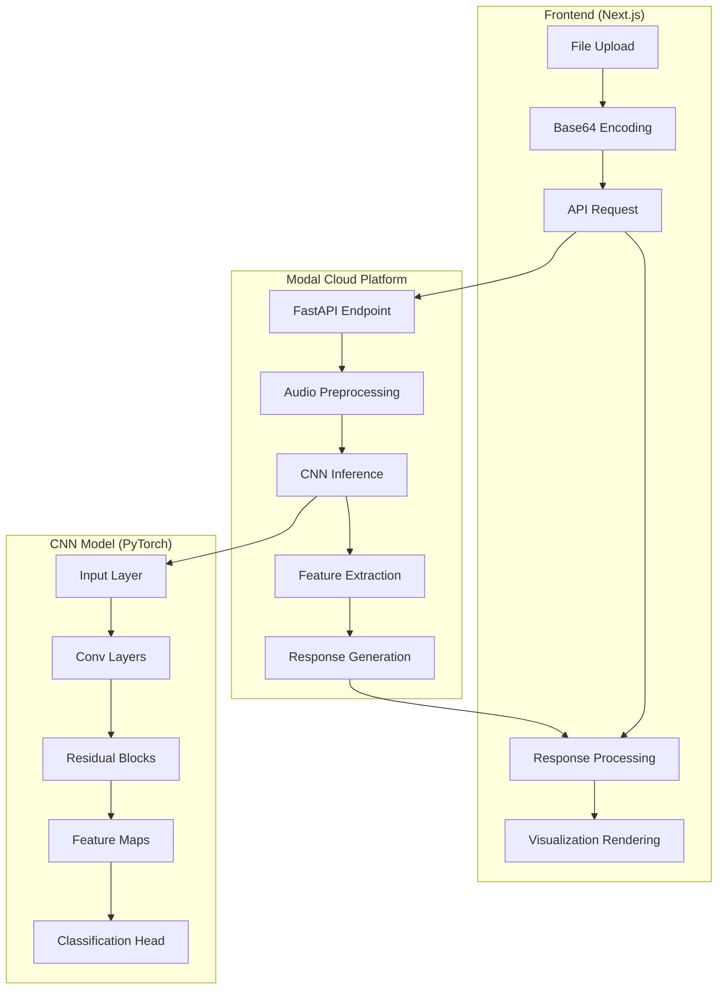

# Technical Architecture - CNN Audio Visualizer

## System Architecture Overview



## Component Breakdown

### Frontend Architecture

#### 1. **Next.js App Structure**
```
audio_cnn_visualization/
├── src/
│   ├── app/
│   │   ├── layout.tsx          # Root layout
│   │   └── page.tsx            # Main application
│   ├── components/
│   │   ├── FeatureMap.tsx      # Heatmap visualization
│   │   ├── Waveform.tsx        # Audio waveform
│   │   ├── ColorScale.tsx      # Color legend
│   │   └── ui/                 # Shadcn components
│   ├── lib/
│   │   └── utils.ts            # Utility functions
│   └── styles/
│       └── globals.css         # Global styles
├── public/                     # Static assets
├── package.json               # Dependencies
└── next.config.js             # Next.js config
```

#### 2. **State Management Flow**
```typescript
// Main Application State
interface AppState {
    vizData: ApiResponse | null;    // Visualization data
    isLoading: boolean;             // Loading state
    fileName: string;               // Uploaded file name
    error: string | null;           // Error messages
}

// State Transitions
IDLE → LOADING → SUCCESS/ERROR → IDLE
```

#### 3. **Component Hierarchy**
```
HomePage
├── FileUpload
├── LoadingSpinner
├── ErrorDisplay
└── VisualizationContainer
    ├── PredictionsCard
    ├── SpectrogramCard
    ├── WaveformCard
    └── FeatureMapsGrid
        └── LayerVisualization[]
            ├── MainFeatureMap
            └── InternalBlocks[]
```

### Backend Architecture (Modal)

#### 1. **Modal App Configuration**
```python
# App Definition
app = modal.App("audio-cnn-inference")

# Container Image
image = (
    modal.Image.debian_slim()
    .pip_install_from_requirements("requirements.txt")
    .apt_install(["libsndfile1"])
    .add_local_python_source("model")
)

# Persistent Storage
model_volume = modal.Volume.from_name("esc-model")
```

#### 2. **Class-Based Deployment**
```python
@app.cls(
    image=image,
    gpu="A10G",                    # GPU type
    volumes={"/models": model_volume},
    scaledown_window=15            # Auto-scaling config
)
class AudioClassifier:
    @modal.enter()                 # Initialization
    def load_model(self):
        # Load PyTorch model
        # Initialize audio processor
        
    @modal.fastapi_endpoint(method="POST", docs=True)
    def inference(self, request: InferenceRequest):
        # Process audio
        # Run inference
        # Extract visualizations
        # Return response
```

#### 3. **Request/Response Flow**
```python
# Input Processing Pipeline
Audio File → Base64 → BytesIO → soundfile.read() → numpy array

# Audio Preprocessing
Raw Audio → Mono Conversion → Resampling → Normalization

# CNN Processing
Audio Array → Spectrogram → Feature Maps → Predictions

# Response Generation
Features → JSON Serialization → HTTP Response
```

## Data Structures

### API Request/Response

#### Request Format
```typescript
interface InferenceRequest {
    audio_data: string;  // Base64 encoded audio file
}
```

#### Response Format
```typescript
interface ApiResponse {
    predictions: Prediction[];
    visualization: VisualizationData;
    input_spectrogram: LayerData;
    waveform: WaveformData;
}

interface Prediction {
    class: string;      // ESC-50 class name
    confidence: number; // 0.0 - 1.0
}

interface LayerData {
    shape: number[];    // [height, width]
    values: number[][]; // 2D array
}

interface WaveformData {
    values: number[];   // 1D audio samples
    sample_rate: number;
    duration: number;
}

interface VisualizationData {
    [layerName: string]: LayerData;
}
```

### CNN Model Structure

#### Model Architecture
```python
class AudioCNN(nn.Module):
    def __init__(self, num_classes=50):
        # Initial convolution
        self.conv1 = nn.Sequential(
            nn.Conv2d(1, 64, kernel_size=7, stride=2, padding=3),
            nn.BatchNorm2d(64),
            nn.ReLU(inplace=True),
            nn.MaxPool2d(kernel_size=3, stride=2, padding=1)
        )
        
        # Residual layers
        self.layer1 = nn.ModuleList([ResidualBlock(64, 64) for _ in range(3)])
        self.layer2 = nn.ModuleList([ResidualBlock(...) for _ in range(4)])
        self.layer3 = nn.ModuleList([ResidualBlock(...) for _ in range(6)])
        self.layer4 = nn.ModuleList([ResidualBlock(...) for _ in range(3)])
        
        # Classification head
        self.avgpool = nn.AdaptiveAvgPool2d((1, 1))
        self.dropout = nn.Dropout(0.5)
        self.fc = nn.Linear(512, num_classes)
```

#### Feature Map Extraction
```python
def forward(self, x, return_feature_maps=False):
    if return_feature_maps:
        feature_maps = {}
        
        # Extract features at each layer
        x = self.conv1(x)
        feature_maps["conv1"] = x
        
        for i, block in enumerate(self.layer1):
            x = block(x, feature_maps, prefix=f"layer1.block{i}")
            feature_maps["layer1"] = x
        
        # ... similar for other layers
        
        return x, feature_maps
    else:
        # Standard forward pass
        return self.standard_forward(x)
```

## Visualization Implementation

### Feature Map Rendering

#### Canvas-Based Heatmaps
```typescript
const FeatureMap: React.FC<FeatureMapProps> = ({ data, title, spectrogram }) => {
    const canvasRef = useRef<HTMLCanvasElement>(null);
    
    useEffect(() => {
        const canvas = canvasRef.current;
        const ctx = canvas.getContext('2d');
        
        // Normalize data to [0, 1]
        const normalizedData = normalizeData(data);
        
        // Create ImageData
        const imageData = ctx.createImageData(width, height);
        
        // Map values to colors
        for (let y = 0; y < height; y++) {
            for (let x = 0; x < width; x++) {
                const value = normalizedData[y][x];
                const color = spectrogram ? 
                    spectrogramColorMap(value) : 
                    featureMapColorMap(value);
                
                const index = (y * width + x) * 4;
                imageData.data[index] = color.r;     // Red
                imageData.data[index + 1] = color.g; // Green
                imageData.data[index + 2] = color.b; // Blue
                imageData.data[index + 3] = 255;     // Alpha
            }
        }
        
        ctx.putImageData(imageData, 0, 0);
    }, [data]);
    
    return <canvas ref={canvasRef} width={width} height={height} />;
};
```

#### Color Mapping Functions
```typescript
// Spectrogram: Blue to Yellow to Red
const spectrogramColorMap = (value: number) => {
    if (value < 0.5) {
        return {
            r: 0,
            g: Math.floor(value * 2 * 255),
            b: 255
        };
    } else {
        return {
            r: Math.floor((value - 0.5) * 2 * 255),
            g: 255,
            b: Math.floor((1 - value) * 2 * 255)
        };
    }
};

// Feature Maps: Blue to White to Red
const featureMapColorMap = (value: number) => {
    const intensity = Math.abs(value);
    const isPositive = value >= 0;
    
    return isPositive ? 
        { r: Math.floor(intensity * 255), g: 0, b: 0 } :
        { r: 0, g: 0, b: Math.floor(intensity * 255) };
};
```

### Waveform Rendering

#### SVG Path Generation
```typescript
const Waveform: React.FC<WaveformProps> = ({ data, title }) => {
    const pathData = useMemo(() => {
        const width = 800;
        const height = 200;
        const centerY = height / 2;
        
        let path = `M 0 ${centerY}`;
        
        for (let i = 0; i < data.length; i++) {
            const x = (i / data.length) * width;
            const y = centerY - (data[i] * centerY);
            path += ` L ${x} ${y}`;
        }
        
        return path;
    }, [data]);
    
    return (
        <svg width="100%" height="200" viewBox="0 0 800 200">
            <path
                d={pathData}
                stroke="currentColor"
                strokeWidth="1"
                fill="none"
            />
        </svg>
    );
};
```

## Performance Considerations

### Frontend Optimizations

#### 1. **Memoization**
```typescript
// Expensive computations
const { main, internals } = useMemo(() => 
    vizData ? splitLayers(vizData.visualization) : { main: [], internals: {} },
    [vizData]
);

// Component memoization
const MemoizedFeatureMap = React.memo(FeatureMap);
```

#### 2. **Lazy Loading**
```typescript
// Code splitting for large components
const FeatureMapGrid = lazy(() => import('./FeatureMapGrid'));

// Conditional rendering
{vizData && (
    <Suspense fallback={<LoadingSpinner />}>
        <FeatureMapGrid data={vizData.visualization} />
    </Suspense>
)}
```

#### 3. **Virtual Scrolling**
```typescript
// For large feature map lists
const VirtualizedFeatureList = ({ items }) => {
    const [visibleRange, setVisibleRange] = useState({ start: 0, end: 10 });
    
    return (
        <div className="overflow-auto" onScroll={handleScroll}>
            {items.slice(visibleRange.start, visibleRange.end).map(item => 
                <FeatureMap key={item.id} {...item} />
            )}
        </div>
    );
};
```

### Backend Optimizations

#### 1. **Model Caching**
```python
class AudioClassifier:
    def __init__(self):
        self._model = None
        self._audio_processor = None
    
    @property
    def model(self):
        if self._model is None:
            self._model = self.load_model()
        return self._model
```

#### 2. **Batch Processing**
```python
# Process multiple files in one request
def batch_inference(self, requests: List[InferenceRequest]):
    batch_spectrograms = []
    for request in requests:
        spectrogram = self.process_audio(request.audio_data)
        batch_spectrograms.append(spectrogram)
    
    batch_tensor = torch.stack(batch_spectrograms)
    outputs, feature_maps = self.model(batch_tensor, return_feature_maps=True)
    
    return [self.format_response(output, fmaps) 
            for output, fmaps in zip(outputs, feature_maps)]
```

#### 3. **Response Compression**
```python
import gzip
import json

def compress_response(data):
    json_str = json.dumps(data)
    compressed = gzip.compress(json_str.encode())
    return base64.b64encode(compressed).decode()
```

## Deployment & Scaling

### Modal Deployment
```bash
# Deploy to production
modal deploy main.py

# Serve for development
modal serve main.py

# View logs
modal logs audio-cnn-inference

# Monitor usage
modal stats audio-cnn-inference
```

### Frontend Deployment
```bash
# Build for production
npm run build

# Deploy to Vercel
vercel deploy

# Deploy to Netlify
netlify deploy --prod
```

### Environment Configuration
```bash
# .env.local
NEXT_PUBLIC_INFERENCE_URL=https://your-modal-endpoint.modal.run
NEXT_PUBLIC_API_TIMEOUT=30000
NEXT_PUBLIC_MAX_FILE_SIZE=10485760  # 10MB
```

## Security Considerations

### Input Validation
```python
# Backend validation
def validate_audio_request(request: InferenceRequest):
    # Check base64 format
    try:
        audio_bytes = base64.b64decode(request.audio_data)
    except Exception:
        raise ValueError("Invalid base64 encoding")
    
    # Check file size
    if len(audio_bytes) > MAX_FILE_SIZE:
        raise ValueError("File too large")
    
    # Validate audio format
    try:
        audio_data, sample_rate = sf.read(io.BytesIO(audio_bytes))
    except Exception:
        raise ValueError("Invalid audio file")
```

### Frontend Security
```typescript
// File type validation
const validateFile = (file: File) => {
    const allowedTypes = ['audio/wav', 'audio/wave'];
    if (!allowedTypes.includes(file.type)) {
        throw new Error('Only WAV files are allowed');
    }
    
    const maxSize = 10 * 1024 * 1024; // 10MB
    if (file.size > maxSize) {
        throw new Error('File too large');
    }
};
```

## Monitoring & Debugging

### Error Handling
```typescript
// Frontend error boundary
class VisualizationErrorBoundary extends React.Component {
    constructor(props) {
        super(props);
        this.state = { hasError: false, error: null };
    }
    
    static getDerivedStateFromError(error) {
        return { hasError: true, error };
    }
    
    componentDidCatch(error, errorInfo) {
        console.error('Visualization error:', error, errorInfo);
        // Send to error reporting service
    }
    
    render() {
        if (this.state.hasError) {
            return <ErrorFallback error={this.state.error} />;
        }
        
        return this.props.children;
    }
}
```

### Performance Monitoring
```typescript
// Track API performance
const trackApiCall = async (url: string, payload: any) => {
    const startTime = performance.now();
    
    try {
        const response = await fetch(url, {
            method: 'POST',
            body: JSON.stringify(payload)
        });
        
        const endTime = performance.now();
        const duration = endTime - startTime;
        
        // Log metrics
        console.log(`API call took ${duration}ms`);
        
        return response;
    } catch (error) {
        console.error('API call failed:', error);
        throw error;
    }
};
```

This technical architecture provides the foundation for understanding, maintaining, and extending your CNN Audio Visualizer system.
